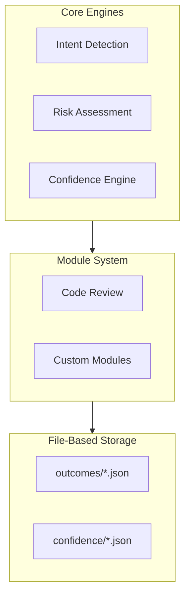
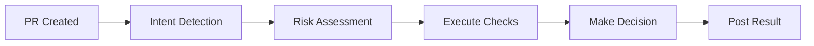
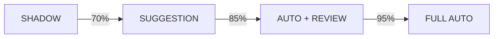

# AURIX

**Confidence-Driven Autonomy Platform for Enterprise AI**

> Removing humans from workflows only when risk allows.

[](https://github.com/features/actions)
[](https://www.python.org/downloads/)
[](LICENSE)

---

## Overview

AURIX is a governance platform that determines when AI systems can safely replace human approvals in enterprise workflows. Unlike traditional automation that blindly removes humans, AURIX ensures AI autonomy is **earned through demonstrated performance**.

### Core Principles

| Principle | Description |
|-----------|-------------|
| **Risk-Based** | Automation level tied to actual risk profile |
| **Confidence-Driven** | Statistical rigor using Wilson score intervals |
| **Graduated Autonomy** | Progressive trust earned through performance |
| **Transparent** | Full audit trail of all decisions |

---

## Architecture



---

## How It Works

### Review Pipeline



| Step | Description |
|------|-------------|
| **Intent Detection** | AI analyzes code to understand true intent, not just PR title |
| **Risk Assessment** | Semantic analysis of auth, payments, PII, database changes |
| **Execute Checks** | Security, logic, complexity, documentation analysis |
| **Make Decision** | APPROVE, REQUEST_CHANGES, or BLOCK with confidence score |
| **Post Result** | Comment on PR with findings and decision |

### Graduation System



| Mode | Behavior | Requirements |
|------|----------|--------------|
| **Shadow** | AI runs silently, human decides | Default for new repos |
| **Suggestion** | AI suggests, human approves | 70% confidence, 10+ reviews |
| **Auto + Review** | AI decides, 10% spot-check | 85% confidence, 20+ reviews |
| **Full Auto** | Complete automation | 95% confidence, <2% error rate |

---

## Quick Start

### 1. Add Workflow

Create `.github/workflows/aurix-review.yml`:

```yaml
name: Aurix Code Review

on:
  pull_request:
    types: [opened, synchronize, ready_for_review]

permissions:
  contents: read
  pull-requests: write

jobs:
  review:
    runs-on: ubuntu-latest
    steps:
      - uses: actions/checkout@v4
        with:
          fetch-depth: 0

      - uses: actions/setup-python@v5
        with:
          python-version: '3.11'

      - name: Install Aurix
        run: pip install git+https://github.com/cstpalash/aurix.git

      - name: Run Review
        env:
          GITHUB_TOKEN: ${{ secrets.GITHUB_TOKEN }}
          OPENAI_API_KEY: ${{ secrets.OPENAI_API_KEY }}
        run: |
          python -m aurix.actions.run \
            --repo "${{ github.repository }}" \
            --pr "${{ github.event.pull_request.number }}" \
            --action review
```

### 2. Configure Secrets

| Secret | Required | Description |
|--------|----------|-------------|
| `OPENAI_API_KEY` | Optional | Enables AI-enhanced reviews (~$0.01/review) |
| `AURIX_AI_MODEL` | Optional | Override model (default: `gpt-4o-mini`) |

### 3. Open a PR

Aurix will automatically analyze and comment on your pull request.

---

## Configuration

### Team Configuration

Create `.aurix/config.yaml`:

```yaml
team_name: "Platform Engineering"

auto_merge:
  enabled: true
  min_score: 0.85
  max_risk_level: low
  excluded_paths:
    - "**/*.sql"
    - "**/infrastructure/**"

human_review:
  always_review_paths:
    - "**/security/**"
    - "**/auth/**"
```

### AI Model Options

| Model | Cost | Use Case |
|-------|------|----------|
| `gpt-4o-mini` | $0.15/$0.60 per 1M tokens | Default, cost-effective |
| `gpt-4o` | $2.50/$10.00 per 1M tokens | High-stakes code |

---

## Security Detection

| Pattern | Severity |
|---------|----------|
| Hardcoded credentials | Critical |
| Shell injection | Critical |
| Unsafe eval/exec | High |
| Insecure deserialization | High |
| Insecure HTTP | Medium |

---

## Cost Structure

| Component | Cost |
|-----------|------|
| GitHub Actions | Free |
| File Storage | Free |
| AI Reviews | ~$0.01/review |

**Estimated monthly cost for 1,000 PRs: ~$10**

---

## License

MIT License - See [LICENSE](LICENSE) for details.
